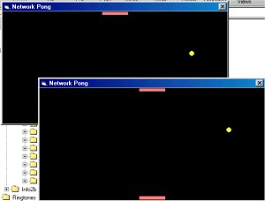



## Network Pong Game

### Description

This is a very simple pong game I made using the winsock control. It allows two players to play the game over a network, with quite good performance.
 
### More Info
 

             |
---                |---
**Submitted On**   |2001-11-29 20:45:14
**By**             |[Dino Scarcella](https://github.com/Planet-Source-Code/PSCIndex/blob/master/ByAuthor/dino-scarcella.md)
**Level**          |Intermediate
**User Rating**    |4.7 (14 globes from 3 users)
**Compatibility**  |VB 5\.0, VB 6\.0
**Category**       |[Games](https://github.com/Planet-Source-Code/PSCIndex/blob/master/ByCategory/games__1-38.md)
**World**          |[Visual Basic](https://github.com/Planet-Source-Code/PSCIndex/blob/master/ByWorld/visual-basic.md)
**Archive File**   |[Network\_Po78518522002\.zip](https://github.com/Planet-Source-Code/dino-scarcella-network-pong-game__1-34345/archive/master.zip)

